VPN Configuration Lab
Overview

A small business needs a way for employees to securely reach internal systems while working outside the office. This project simulates that problem: a Windows Server VPN built in Azure, using RRAS and SSTP, that lets a remote device tunnel into the company network, receive an internal IP address, and communicate with internal resources as if it were on site.

Scope: 1 VPN server, 1 remote client on a separate network, a static IP pool for VPN clients, a dedicated dial-in account, and a full connection test verified end to end with ipconfig, ping, and tracert.

Skills & Tools
Category	Tools/Skills
Cloud Infrastructure	Microsoft Azure (Resource Groups, Virtual Networks, Virtual Machines, Network Security Groups)
Remote Access	Routing and Remote Access (RRAS), SSTP
Access Management	Dedicated dial-in accounts, least-privilege access control
Security	Certificate creation, export, and trust configuration
Networking	TCP/IP, static IP address pooling, NSG rules
Verification	ipconfig, ping, tracert
Environment
VPN Server: Windows Server 2022 Datacenter (vm-vpnserver)
Client Machine: Windows Server 2022, standing in for a remote employee device (vm-vpnclient)
Platform: Microsoft Azure
Network: vnet-vpn-lab (10.0.0.0/16) for the server, a separate VNet for the client
Architecture

Show Image

The client sits in its own separate network rather than the server's, so the connection genuinely simulates an outside employee rather than two VMs that could already reach each other locally. SSTP was chosen over IKEv2 because it rides on TCP 443, which passes cleanly through Azure's default networking without opening nonstandard ports. VPN clients get addresses from a static pool (10.0.1.x) kept outside the server's own subnet, so remote connections are easy to identify and never collide with existing addresses.

Steps

1. Created the server VM and its own virtual network in Azure

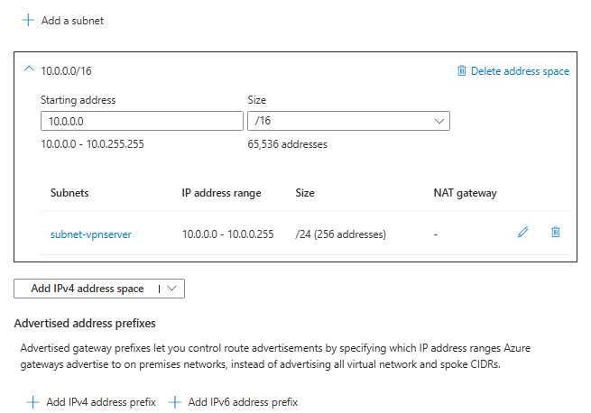  

2. Installed the Remote Access role with the DirectAccess and VPN (RAS) role service

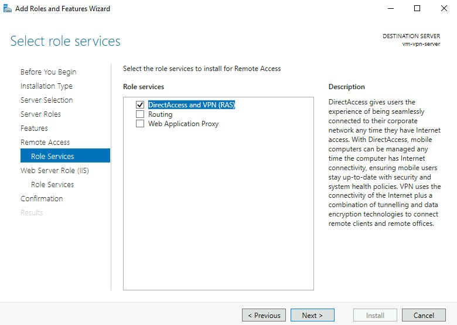  

3. Configured RRAS for VPN access using a custom configuration

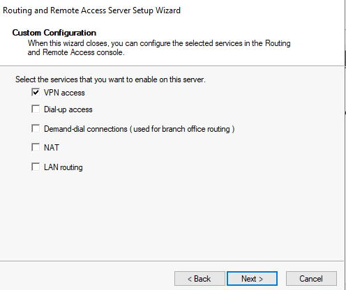  

4. Set up a static IP address pool to hand out addresses to connecting clients

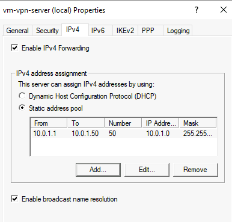  

5. Created a dedicated user account with dial-in permission, separate from any administrator account

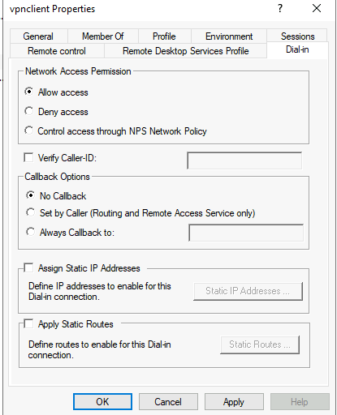  

6. Opened the required inbound port (TCP 443) on the network security group

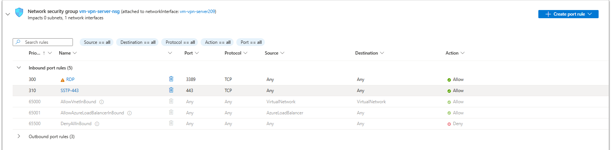  

7. Confirmed the server VM's specs and public IP

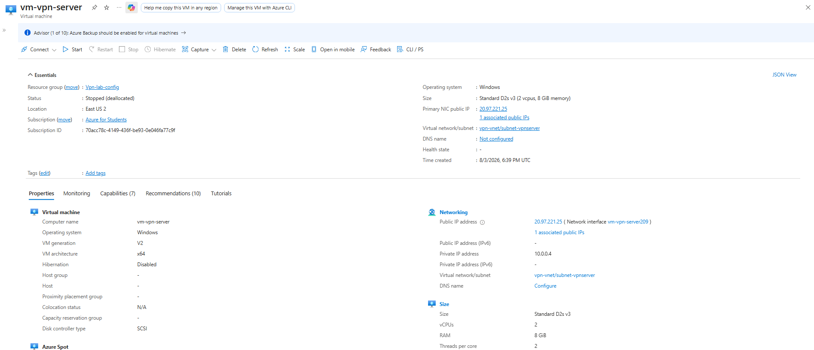  

8. Created a self signed certificate on the server and bound it to the SSTP listener

9. Built a separate client VM in its own network to represent a remote employee's device

10. Configured a VPN connection on the client using SSTP and the server's public IP

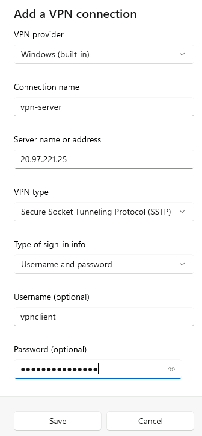  

11. Hit a certificate trust error on first connection attempt

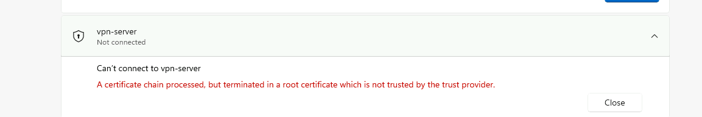  

12. Exported the server's certificate and imported it into the client's trusted root store

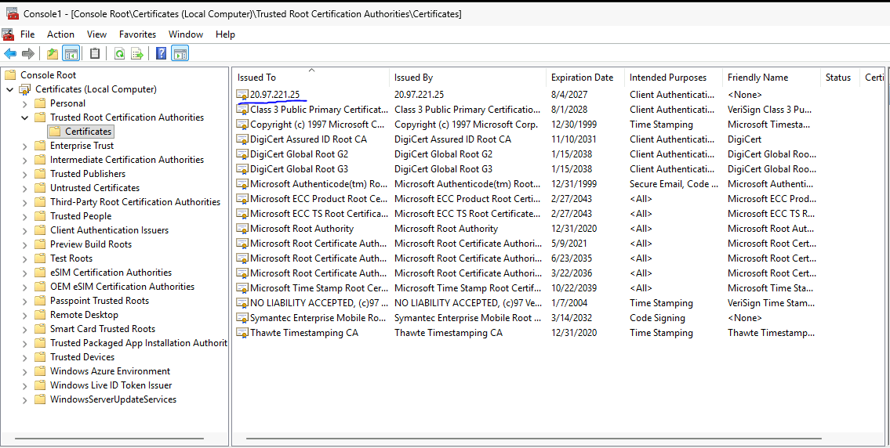  

13. Connected the VPN successfully

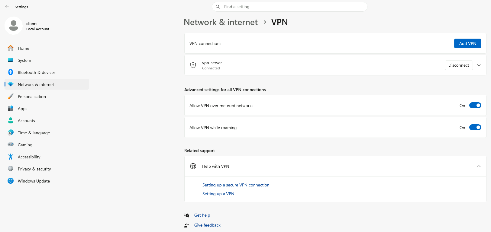  

14. Confirmed the client received an address from the configured pool

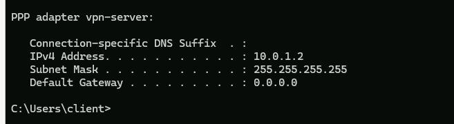  

15. Verified connectivity with a successful ping to the server's internal address

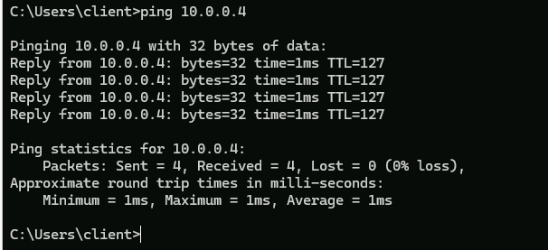  

16. Verified the route with a traceroute through the tunnel

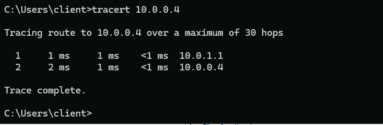  

Troubleshooting Notes
Certificate trust error on connect, since SSTP needs the client to trust the server's cert; fixed by importing the server's certificate into the client's trusted root store
Ping timeouts caused by Windows Firewall blocking ICMP by default; fixed by enabling the Echo Request (ICMPv4-In) rules
Connection failed after a VM restart since RRAS didn't resume automatically; fixed by restarting the service
Why This Project Matters

Without a secure way to connect back to the office network, remote employees either can't reach internal files and systems, or they find workarounds that put company data at risk. This project solves that directly: a remote device gets an authenticated, encrypted path into the internal network, with its own address space and access controls.
